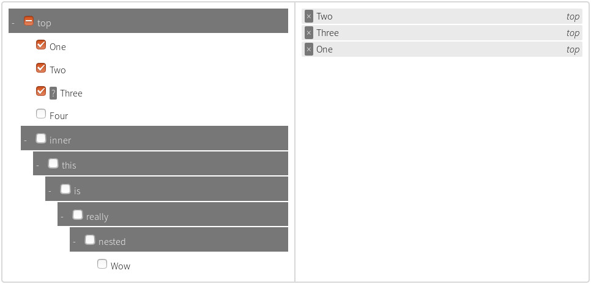

## jQuery Tree Multiselect
[](https://circleci.com/gh/patosai/tree-multiselect.js)
[](https://codecov.io/gh/patosai/tree-multiselect.js)
[](https://david-dm.org/patosai/tree-multiselect.js#info=devDependencies)


**This plugin allows you to add a sweet treeview frontend to a `<select>` node.**
The underlying `<select>` node can be used as it was before. This means you can still use `$("select").val()` or `selectElement.value` to get the value, as if there was no plugin. If you want to add options dynamically, please continue reading, there are some more steps you need to take.

* Make sure you've got `<meta charset="UTF-8">` in your `<head>` or some of the symbols may look strange.
* Requires jQuery v1.8+



### Demo
<a target="_blank" href="http://www.patosai.com/projects/tree-multiselect">My website has a simple demo running.</a>

### How To Use
1. Set the `multiple="multiple"` attribute on your `<select>`
2. Add attributes to `<option>` nodes
3. Execute `$.treeMultiselect(params)` with whatever params you want

### Setting up your `<select>`
* Make sure your `<select>` has the `multiple` attribute set.

The `<option>` children can have the following attributes.

#### Option Attributes
Option Attribute name         | Description
----------------------------- | ---------------------------------
`selected`                    | Have the option pre-selected. This is actually part of the HTML spec. For specified ordering of these, use `data-index`
`readonly`                    | User cannot modify the value of the option. Option can be selected (ex. `<option selected readonly ...`)
`data-section`                | The section the option will be in; can be nested
`data-description`            | A description of the attribute; will be shown on the multiselect
`data-index`                  | For pre-selected options, display options in this order, lowest index first. Repeated items with the same index will be shown before items with a higher index. Otherwise items will be displayed in the order of the original `<select>`

All of the above are optional.

Your `data-section` can have multiple section names, separated by the `sectionDelimiter` option. If you don't have a `data-section` on an option, the option will be on the top level (no section).

Ex. `data-section="top/middle/inner"` will show up as
- `top`
  - `middle`
    - `inner`
      - your option

### API
#### `$.treeMultiselect(params)`
Renders a tree for the given jQuery `<select>` nodes. `params` is optional.

```javascript
$("select").treeMultiselect();
```
```javascript
let params = {searchable: true};
$("select").treeMultiselect(params);
```
```javascript
function treeOnChange(allSelectedItems, addedItems, removedItems) {
  console.log("something changed!");
}

$("select").treeMultiselect({
  allowBatchSelection: false,
  onChange: treeOnChange,
  startCollapsed: true
});
```

##### Params
Name                    | Default        | Description
----------------------- | -------------- | ---------------
`allowBatchSelection`   | `true`         | Sections have checkboxes which when checked, check everything within them
`collapsible`           | `true`         | Adds collapsibility to sections
`enableSelectAll`       | `false`        | Enables selection of all or no options
`selectAllText`         | `Select All`   | Only used if `enableSelectAll` is active
`unselectAllText`       | `Unselect All` | Only used if `enableSelectAll` is active
`freeze`                | `false`        | Disables selection/deselection of options; aka display-only
`hideSidePanel`         | `false`        | Hide the right panel showing all the selected items
`maxSelections`         | `0`            | A number that sets the maximum number of options that can be selected. Any positive integer is valid; anything else (such as `0` or `-1`) means no limit
`onChange`              | `null`         | Callback for when select is changed. Called with (allSelectedItems, addedItems, removedItems), each of which is an array of objects with the properties `text`, `value`, `initialIndex`, and `section`
`onlyBatchSelection`    | `false`        | Only sections can be checked, not individual items
`sortable`              | `false`        | Selected options can be sorted by dragging (requires jQuery UI)
`searchable`            | `false`        | Allows searching of options
`searchParams`          | `['value', 'text', 'description', 'section']` | Set items to be searched. Array must contain `'value'`, `'text'`, or `'description'`, and/or `'section'`
`sectionDelimiter`      | `/`            | Separator between sections in the select option `data-section` attribute
`showSectionOnSelected` | `true`         | Show section name on the selected items
`startCollapsed`        | `false`        | Activated only if `collapsible` is true; sections are collapsed initially

#### Examples


#### `.remove()`
Removes the tree from the DOM. Leaves the original `<select>` intact.
```javascript
let trees = $("select").treeMultiselect({searchable: true});
let firstTree = trees[0];
firstTree.remove();
```

#### `.reload()`
Reinitializes the tree. You can add `<option>` children to the original `<select>` and call `.reload()` to render the new options. User-changed selections will be saved.

```javascript
let trees = $("select").treeMultiselect();
let firstTree = trees[0];

// add an option
$("select#id").append("<option value='newValue' data-section='New Section' selected='selected' data-description='New value'>New Value</option>");
firstTree.reload();
```

### Installation
Load `jquery.tree-multiselect.min.js` on to your web page. The css file is optional (but recommended).

You can also use bower - `bower install tree-multiselect`

### FAQ
`Help! The first element is selected when I create the tree. How do I make the first element not selected?`
You didn't set the `multiple` attribute on your `<select>`. This is a property of single-option select nodes - the first option is selected.

### License
MIT licensed.
